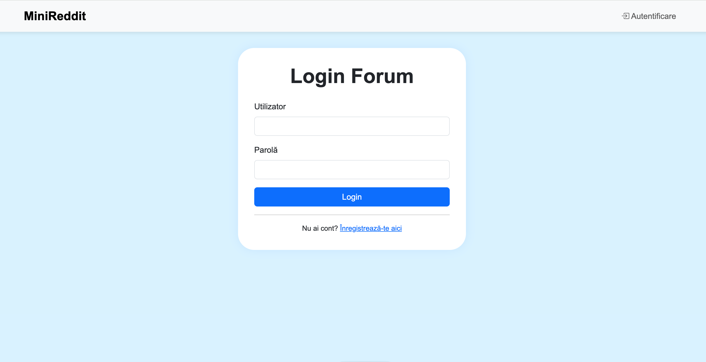
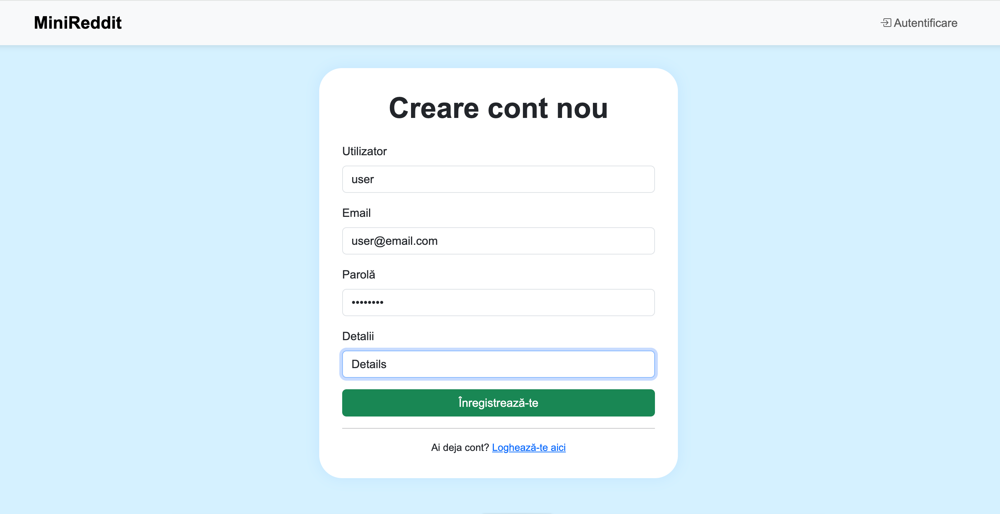
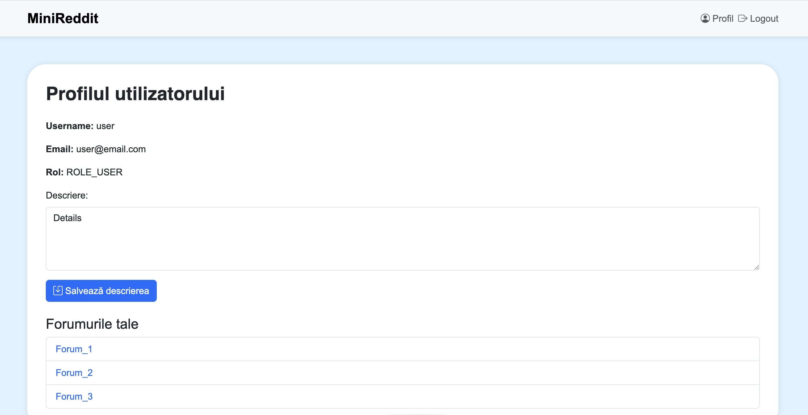
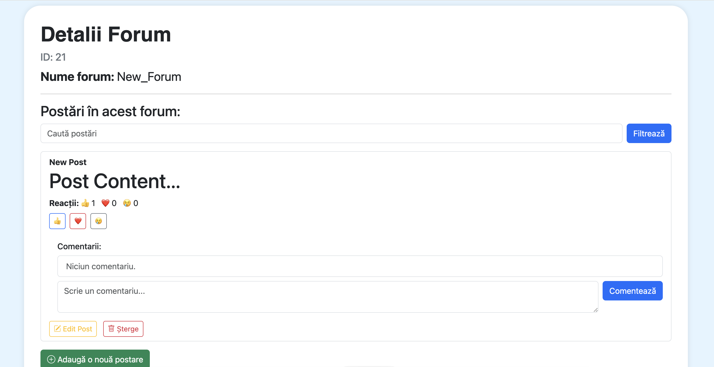

# miniReddit 🧠

- MiniReddit este o aplicație web simplificată de tip forum, dezvoltată cu Java, Spring Boot, Hibernate și JSP. Aceasta simulează funcționalitățile de bază ale unei platforme de discuții precum Reddit.
---

## 🔧 Tehnologii utilizate

- Java 17
- Spring Boot
- Spring Security
- Spring MVC
- Spring Data JPA
- MySQL
- JSP (Java Server Pages)
- Bootstrap 5 + Bootstrap Icons
- Quill.js pentru editorul de text
- HTML, CSS
- Jakarta EE (Servlets + Validări)
- Maven

---

## ⚙️ Cum pornești aplicația

1. Asigură-te că ai instalat:
   - Java 17+
   - Maven
   - MySQL (cu baza de date `reddit`)
2. Clonează proiectul:
```bash
git clone https://github.com/username/miniReddit.git
cd miniReddit
```
3. Creează baza de date MySQL:
```sql
CREATE DATABASE reddit;
```
4. Configurează `application.properties` (vedeți deja setările pentru `root` / `password`)
5. Rulează aplicația:
```bash
mvn spring-boot:run
```
6. Accesează aplicația la: [http://localhost:9876](http://localhost:9876)

---

## 🔐 Funcționalități

- **Autentificare și înregistrare** cu criptarea parolei (BCrypt)
- **Forumuri** (CRUD)
- **Postări** cu editor Quill și imagini
- **Comentarii** (CRUD)
- **Reacții**: 👍 Like, ❤️ Love, 😢 Sad
- **Pagină de profil** cu descriere
- **Filtrare forumuri și postări** după keyword
- **Roluri** (USER & ADMIN)
- Protecție CSRF + configurări custom de securitate

---

## 📸 Capturi de ecran

> Aici poți introduce capturile de ecran salvate. De exemplu:






---

## 📁 Structură generală

- `controller/` – toate controlerele Spring MVC
- `entity/` – entitățile JPA (Forum, Post, User, Reaction, Comment etc.)
- `repository/` – interfețele de acces la date (JPA)
- `service/` – logica aplicației
- `config/` – securitate și configurări web
- `static/` – stiluri, JS, imagini
- `views/` – paginile JSP
- `uploads/` – imagini uploadate de utilizatori

---

## 🧠 Design

Interfața este construită cu un **design modern și aerisit**, folosind:
- Bootstrap 5 pentru stilizare
- Navigare prietenoasă și structură logică
- Responsive și intuitiv

---

## 🤝 Autori

Aplicația a fost dezvoltată de Roberto Chiper ca proiect demonstrativ de tip mini-rețea socială pentru forumuri.

---

## 💡 Îmbunătățiri viitoare

- Pagina principală cu trending posts
- Căutare globală
- Suport pentru Markdown
- Mesagerie privată
- AI pentru sumarizarea postărilor

---

## 🛡️ Securitate

Aplicația folosește Spring Security cu următoarele măsuri:

- BCrypt pentru parole
- Protecție CSRF (customizată pentru endpointuri AJAX)
- Login personalizat cu redirecționare
- Acces bazat pe roluri pentru editare/ștergere

---


## ✅ Testare

Aplicația a fost testată utilizând **JUnit 5** și **Mockito**, concentrându-se pe serviciile cheie ( `USerService`, `ForumService`, `PostService`, `CommentService`, `ReactionService`). Fiecare serviciu este testat izolat cu ajutorul depependentelor mockuite, verificând:

- Salvarea și recuperarea datelor
- Căutările personalizate în baza de date
- Ștergerea entităților
- Logica specifică de update sau filtrare (ex: reacții)

Exemple:
```java
@Test
void testCreateForum() {
    Forum forum = new Forum("Java", new User());
    when(forumRepository.save(forum)).thenReturn(forum);
    Forum result = forumService.createForum(forum);
    assertEquals("Java", result.getName());
}
```

```java
@Test
void testCountReactions() {
    Post post = new Post();
    Reaction r1 = new Reaction(); r1.setType(ReactionType.LIKE);
    Reaction r2 = new Reaction(); r2.setType(ReactionType.LIKE);
    Reaction r3 = new Reaction(); r3.setType(ReactionType.SAD);
    when(reactionRepository.findByPost(post)).thenReturn(Arrays.asList(r1, r2, r3));
    long likeCount = reactionService.countReactions(post, ReactionType.LIKE);
    assertEquals(2, likeCount);
}
```

Toate testele pot fi rulate cu `mvn test` sau direct din IDE (ex: IntelliJ IDEA).

